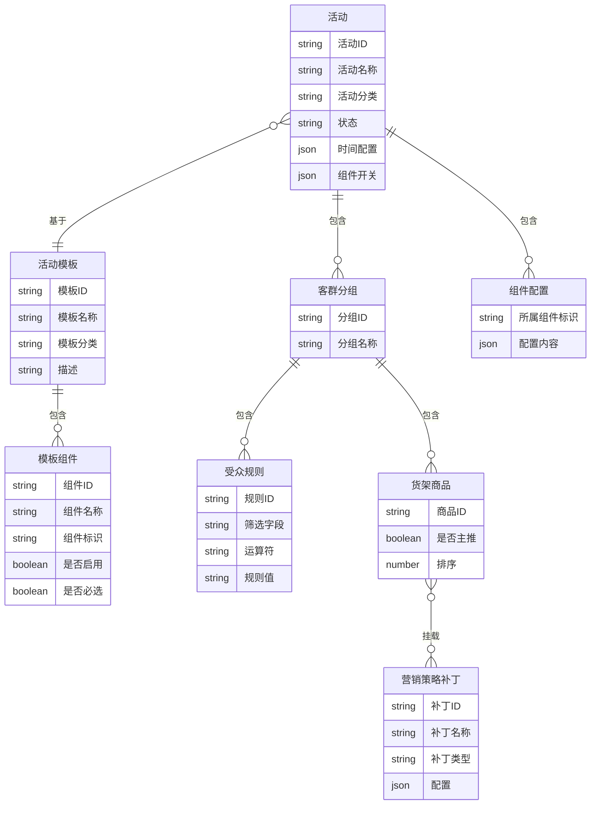
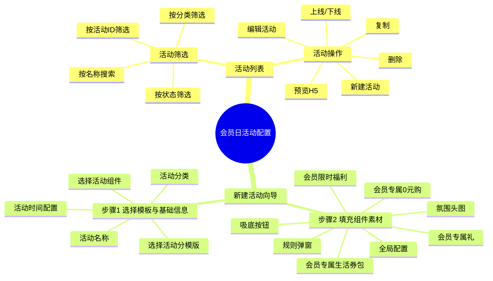
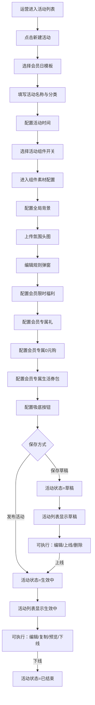

# 运营人员可以通过会员日活动配置功能实现每月会员日活动的快速上线

---

## 一、需求背景（20%）

### 1.1 业务大背景（5%）

对齐会员业务团队 OKR——"提升会员留存率与付费转化率"。会员日是美柚会员体系中最高频的营销触点，每月定期举办，直接影响会员续费意愿与新增转化。当前会员日活动配置依赖开发人员硬编码上线，每次活动变更需排期 1-2 人天，严重制约运营节奏。

### 1.2 业务子背景（5%）

- 运营反馈：每月会员日活动上线前需提前 3-5 天提交需求，开发排期紧张时甚至延期，导致活动错过最佳时间窗口
- 实际 Case：2024年8月会员日因排期冲突推迟2天上线，活动期间 DAU 较预期下降 12%
- 运营期望：能自主配置活动内容、调整组件顺序和素材，当天即可完成上线

### 1.3 现状判断及问题（10%）

| 现状 | 问题判断 | 历史需求或复盘文档 | 解决方案 |
|------|----------|-------------------|----------|
| 会员日活动页面由前端硬编码，每次活动需开发介入修改 | 配置周期长（1-2人天），运营无法自主操作 | 2024Q3 会员日复盘文档 | 建立后台活动管理系统，提供会员日模板，运营自助配置 |
| 活动组件（限时福利、专属礼等）无开关控制 | 上线/下线某个组件需重新发版 | 内部需求池 #218 | 模板内置组件开关矩阵，必选组件锁定，可选组件支持开关 |
| 活动状态（草稿/待生效/生效中/已结束）无统一管理 | 活动生命周期不可控，上线/下线靠人工通知 | — | 活动状态机自动流转，支持一键上线/下线 |
| 无活动预览能力 | 运营无法提前确认效果，上线后才发现问题 | — | 提供H5预览与二维码扫码预览 |

---

## 二、项目目标（5%）

### 2.1 目标描述（5%）

运营人员可通过会员日模板自助完成每月会员日活动的配置与上线，将单次活动配置周期从 1-2 人天缩短至 30 分钟以内，实现运营自主配置、实时预览、一键上线。

### 2.2 迭代节奏

- **Phase 1（当前）**：会员日模板 + 活动创建向导 + 组件配置 + 活动列表管理 + 一键上线/下线
- **Phase 2（后续）**：客群分层与货架配置 + 抽奖挂载 + 素材替换
- **Phase 3（后续）**：数据看板 + 活动效果分析

### 2.3 风险预判

- 组件配置项较多，运营初次使用可能有学习成本 → 提供默认值与模板预填充
- 富文本编辑器（规则弹窗）样式兼容性风险 → 限定编辑器功能范围，兜底纯文本降级
- 活动上线后状态不可逆 → 上线操作增加二次确认弹窗

---

## 三、需求方案（80%）

### 3.1 名词定义

| 名词 | 定义 |
|------|------|
| 会员日模板 | 系统预置的活动模板，包含会员日活动标准组件组合，模板ID为 tpl_002 |
| 活动分模版 | 活动创建时选择的模板类型，决定活动可用的组件集合 |
| 活动组件 | 模板内可配置的功能模块，如氛围头图、会员限时福利等，支持开关控制 |
| 组件开关矩阵 | 控制模板内各组件显隐的机制，必选组件锁定不可关闭，可选组件支持开关 |
| 吸底按钮 | 固定在页面底部的行动引导按钮，按用户状态（非会员/会员已预约/会员未预约）独立配置 |
| 营销策略补丁 | 可挂载到活动商品上的价格/时长/赠品策略，如价格立减、加赠时长、开卡赠礼 |
| 活动状态 | 活动生命周期阶段：草稿 → 待生效 → 生效中 → 已结束 |
| 全局配置 | 活动页面的背景样式配置，支持纯色、渐变色、背景图片三种类型 |

### 3.2 E-R图

### 3.3 产品结构图

### 3.4 产品流程图

### 3.5 原型图

参见项目页面 `/activities/new` 新建活动页面，以及 `/activities` 活动列表页面。

### 3.6 需求说明（60%）

| 功能模块 | 功能点描述 | 优先级 |
|----------|-----------|--------|
| 活动列表 | 活动列表展示与筛选 | High |
| 活动列表 | 活动上线/下线操作 | High |
| 活动列表 | 活动删除操作 | Middle |
| 活动列表 | 活动复制 | Low |
| 活动列表 | 活动H5预览 | High |
| 新建活动 | 会员日模板选择 | High |
| 新建活动 | 活动基础信息填写 | High |
| 新建活动 | 活动分类自定义输入 | Middle |
| 新建活动 | 活动时间配置 | High |
| 新建活动 | 组件开关矩阵 | High |
| 组件配置 | 全局配置（背景类型/颜色/渐变/图片） | High |
| 组件配置 | 氛围头图（图片上传） | High |
| 组件配置 | 规则弹窗（图标+富文本规则说明） | Middle |
| 组件配置 | 会员限时福利（商品+场次+受众） | High |
| 组件配置 | 会员专属礼（商品+展示模式+受众） | Middle |
| 组件配置 | 会员专属0元购（分类+模块头图/背景图） | Middle |
| 组件配置 | 会员专属生活券包（商品+展示模式+受众） | Middle |
| 组件配置 | 吸底按钮（三状态独立配置） | High |
| 活动状态 | 状态流转（草稿→生效中→已结束） | High |
| 活动状态 | 草稿活动一键上线 | High |
| 活动状态 | 生效中活动一键下线 | High |

**详细说明：**

**功能点：活动列表展示与筛选**
- 功能详细说明：
  - 活动列表以表格形式展示所有活动，列包含：活动ID/名称、活动分类、活动状态、模板名称、操作时间/人、操作
  - 活动ID/名称列：上方显示活动ID（act_xxx格式），下方显示活动名称
  - 支持按活动状态（全部/草稿/待生效/生效中/已结束）、活动分类（动态从已有活动提取）、活动ID（支持逗号/空格分隔多个ID）、活动名称进行筛选
  - 活动状态以彩色Badge标签展示：草稿（灰色）、待生效（橙色）、生效中（红色/品牌色）、已结束（绿色）
- 补充说明：活动分类筛选下拉的选项从数据库已有活动中动态提取，包含自定义分类

**功能点：活动上线/下线操作**
- 功能详细说明：
  - 草稿状态活动：操作栏显示"上线"按钮，点击弹出确认弹窗，确认后活动状态变为"生效中"
  - 生效中活动：操作栏显示"下线"按钮，点击后活动状态变为"已结束"
  - 上线操作有二次确认弹窗，防止误操作
- 补充说明：上线/下线通过 PATCH /api/activities/[id] 接口修改 status 字段实现

**功能点：活动删除操作**
- 功能详细说明：
  - 草稿状态活动：操作栏显示"删除"按钮，点击弹出确认弹窗（"删除后不可恢复"），确认后删除活动
  - 非草稿状态活动不显示删除按钮
- 补充说明：删除通过 DELETE /api/activities/[id] 接口实现

**功能点：会员日模板选择**
- 功能详细说明：
  - 新建活动第一步展示模板选择区域，标题为"选择活动分模版"
  - 会员日模板（tpl_002）为可选模板，以卡片形式展示，包含模板名称、分类标签、描述、组件数量
  - 选中模板后自动加载模板预设的8个组件及其开关状态
  - 非会员日分类的模板当前为禁用状态
- 补充说明：模板数据从 /api/templates 接口获取

**功能点：活动基础信息填写**
- 功能详细说明：
  - 活动名称：必填，文本输入框
  - 活动分类：必填，支持输入自定义分类名称或从下拉选择已有分类（促活/转化/拉新等），输入时自动过滤匹配项，选中已有分类后自动填充
  - 活动时间配置：包含售卖时间范围（必填）、缓冲截止时间（必填），其他时间字段选填
- 补充说明：活动分类采用 Input + 自定义下拉方案，支持自由输入新分类名称，保存时直接存入数据库

**功能点：组件开关矩阵**
- 功能详细说明：
  - 标题为"选择活动组件"，以表格形式展示所有组件
  - 每行包含：拖拽排序手柄、组件名称、组件描述、开关控件
  - 必选组件（全局配置、氛围头图、规则弹窗）开关锁定不可关闭，显示为禁用状态
  - 可选组件支持开关控制，未开启状态为浅灰色（bg-gray-200）
  - 组件顺序固定：全局配置 → 氛围头图 → 规则弹窗 → 会员限时福利 → 会员专属礼 → 会员专属0元购 → 会员专属生活券包 → 吸底按钮
- 补充说明：组件开关状态保存到 activities 表的 components JSONB 字段

**功能点：全局配置（背景类型/颜色/渐变/图片）**
- 功能详细说明：
  - 背景类型枚举选择：纯色 / 渐变色 / 图片
  - 纯色模式：展示颜色选择器，选择单一背景色
  - 渐变色模式：展示起始颜色选择器、结束颜色选择器、渐变方向选择（从左到右/从上到下/左上到右下等）
  - 图片模式：展示图片上传组件，上传背景图片
- 补充说明：全局配置为必选组件，不可关闭

**功能点：氛围头图（图片上传）**
- 功能详细说明：
  - 展示图片上传区域，运营上传活动顶部氛围头图
  - 支持图片预览与替换
- 补充说明：氛围头图为必选组件

**功能点：规则弹窗（图标+富文本规则说明）**
- 功能详细说明：
  - 图标配置：上传规则弹窗入口图标
  - 规则文案：富文本编辑器（基于 react-quill-new），支持加粗、斜体、列表、链接等格式
  - 编辑器样式与美柚设计规范对齐，圆角8px、品牌色交互元素
- 补充说明：规则弹窗为必选组件；富文本内容以 HTML 格式存储在 component_configs.rule_popup.ruleRichText 字段

**功能点：会员限时福利（商品+场次+受众）**
- 功能详细说明：
  - 模块头图与背景图：各一个图片上传
  - 福利商品列表：支持添加多个商品，每个商品配置商品ID、库存、抢购图、权益图、弹窗图、跳转链接
  - 抢购场次：每个商品支持添加多个场次，每场配置预约时间范围和抢购时间范围
  - 受众规则：每个商品支持配置独立的受众筛选条件（字段+运算符+值）
  - 无推送文案字段（已移除）
- 补充说明：可选组件，默认开启

**功能点：会员专属礼（商品+展示模式+受众）**
- 功能详细说明：
  - 模块头图与背景图：各一个图片上传
  - 礼品商品列表：支持添加多个商品，每个商品配置商品ID、权益图、展示模式（横图/双列）、排序、受众规则
  - 展示模式：横图（单列展示）或双列（两列并排）
- 补充说明：可选组件，默认关闭

**功能点：会员专属0元购（分类+模块头图/背景图）**
- 功能详细说明：
  - 模块头图与背景图：各一个图片上传
  - 分类ID列表：支持动态添加/删除/编辑分类ID
- 补充说明：可选组件，默认关闭

**功能点：会员专属生活券包（商品+展示模式+受众）**
- 功能详细说明：
  - 模块头图与背景图：各一个图片上传
  - 券包商品列表：支持添加多个商品，每个商品配置商品ID、权益图、展示模式（横图/双列）、排序、受众规则
- 补充说明：可选组件，默认开启

**功能点：吸底按钮（三状态独立配置）**
- 功能详细说明：
  - 按用户状态分Tab独立配置：非会员 / 会员已预约 / 会员未预约
  - 每个状态配置：按钮文案、按钮颜色（颜色选择器）、跳转链接
  - 三个Tab可独立切换，各状态配置互不影响
- 补充说明：可选组件，默认关闭

**功能点：活动状态流转**
- 功能详细说明：
  - 活动状态枚举：草稿（draft）→ 待生效（pending）→ 生效中（active）→ 已结束（ended）
  - 草稿 → 生效中：通过"上线"操作触发，需二次确认
  - 生效中 → 已结束：通过"下线"操作触发
  - 活动列表按状态显示不同操作按钮：草稿显示编辑/复制/上线/删除/预览；生效中显示编辑/复制/下线/预览
- 补充说明：状态存储在 activities 表的 status 字段

### 3.7 对协同方需求

| 协同方 | 需求内容 |
|--------|----------|
| 设计 | 提供会员日活动各组件的默认占位图与示例素材 |
| 运营 | 每月活动上线前完成活动配置与素材上传，确认预览效果后上线 |
| 测试 | 验证活动创建/编辑/上线/下线全流程，验证各组件配置的数据持久化 |

---

## 元数据字段

| 字段 | 值 |
|------|------|
| 状态 | 规划中 |
| 创建模板 | 中后台需求模版 |
| 分类 | 会员 |
| 业务 | 会员订阅 |
| 迭代 | Phase 1 |
| 处理人 | 产品团队 |
| 优先级 | High |
| 需求类型 | 新功能 |
| 需求难度 | A 全新能力 |
| 技术等级 | -- |
| 预估工时 | 15人天 |
